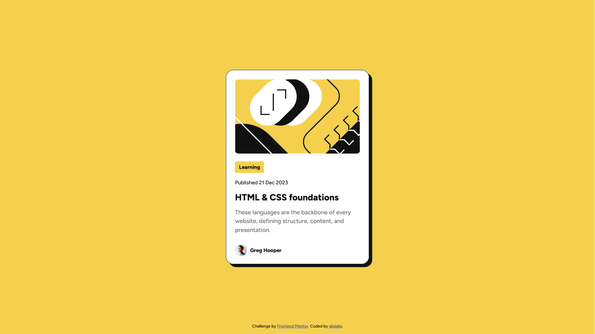

# Frontend Mentor - Blog preview card solution

This is my solution to the [Blog preview card challenge on Frontend Mentor](https://www.frontendmentor.io/challenges/blog-preview-card-ckPaj01IcS).

## Overview

### The challenge

Users should be able to:

- See hover and focus states for all interactive elements on the page

### Screenshot

### Links

- Solution URL: [My Solution URL](https://www.frontendmentor.io/solutions/blog-preview-card-gxpMUbFQS-)
- Live Site URL: [Live Site URL](blog-preview-card-six-pi.vercel.app)

## My process

### Built with

- Semantic HTML5 markup
- CSS custom properties
- Flexbox

### What I learned

I learned that letting go is better than obsessing over getting it to be "perfect", I need to accpet that I don't know how to do some things yet, and that's okay, it doesn't have to be perfect, just good enough.

### Continued development

Viewports are very useful but I couldn't get myself to figure them out, I'm assuming that they are the solution for one of this challenge's tests, which was to resize text without media queries.

I also couldn't figure out resizing the card and it's components without media queries, I'm unsure if the challenge wanted me to do that but I plan on revisiting this project and making it resizable.
